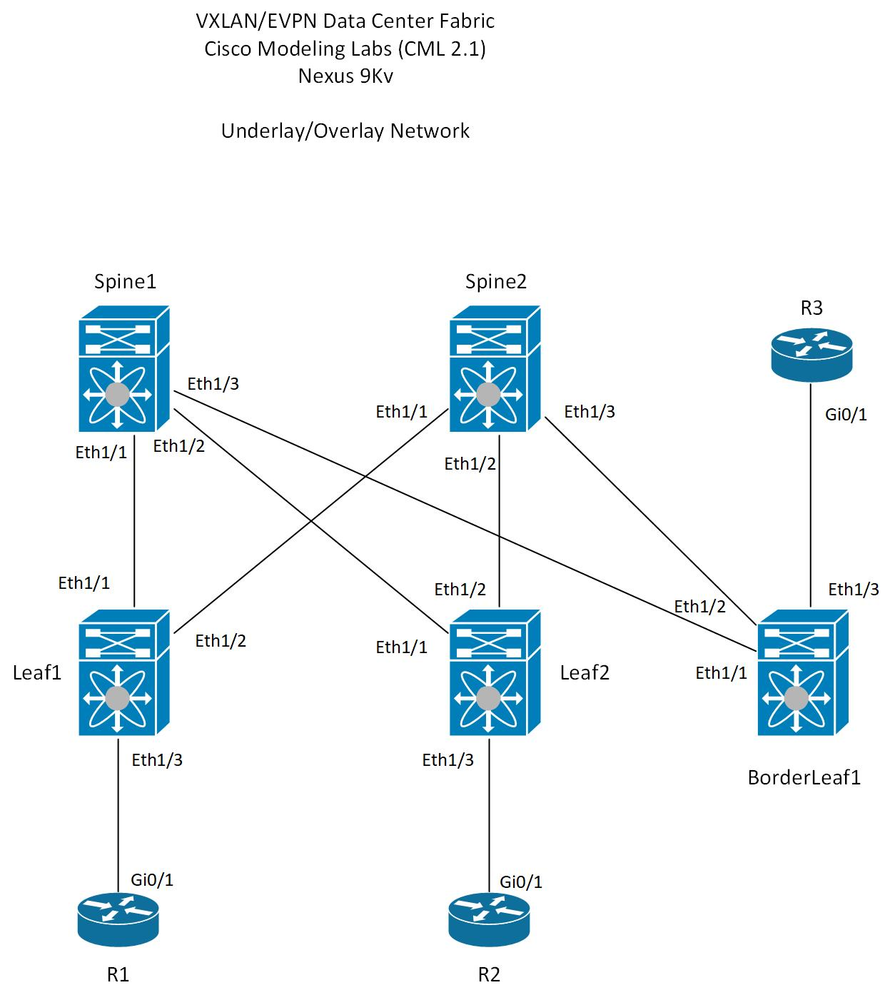
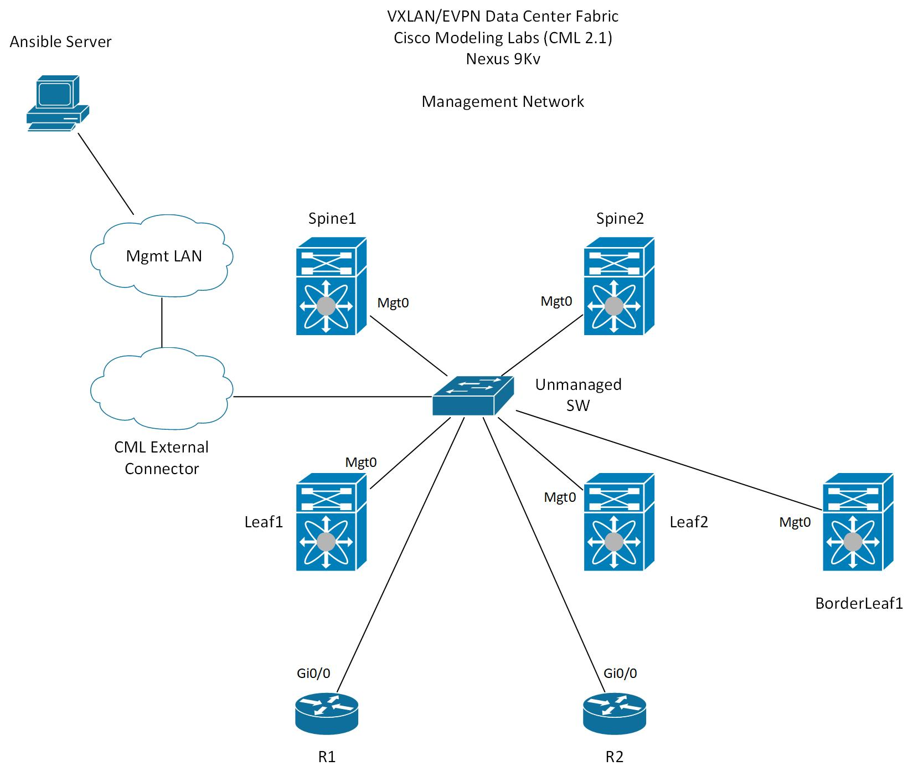

# Ansible VXLAN EVPN IP Fabric
This playbook deploys VXLAN EVPN IP Fabric to Cisco Nexus 9K
switches running in Cisco Modeling Labs (CML). The playbook also
configures two IOS Routers acting as hosts in IP fabric. R3 acts 
as core router and it is assumed is already configured and is 
not configured by this playbook.

Multi-tenancy is achived with VRFs. The current playbook configures
two VRFs but more can be configured. Leaf switches are configured with
distributed anycast gateway for client IP subnets. Arp suppression is enabled
and BUM traffic is handled with Ingress Replication instead of Multicast.

Border leaf is configured to only advertise subnets from fabric to CORE OSPF
instance. Border leaf is configured to advertise default route into BGP fabric.
R3 is configured to advertise default route into CORE OSPF and this allows 
Broder Leaf to advertise default route into BGP.

Configurations for NXOS devices are generated using Jinja2 templates and `host_vars`.
Configurations are copied to NXOS switches using SCP and then configuration is replaced
with candidate configuration. Cisco IOS routers are configured using Ansible IOS Network
modules.

[Setup](#setup)  
[Variables](#variables)  
[Topologies](#topologies)  
[Playbooks](#playbooks)  

## Setup
Playbook was tested on Cisco NXOS and IOS devices running in CML 2.1.  
* Cisco Nexus 9Kv, version 9.2(3)  
* Cisco IOSv, version 15.8(3)M2  

Control machine information:
```
$ lsb_release -a
No LSB modules are available.
Distributor ID:	Ubuntu
Description:	Ubuntu 20.04.2 LTS
Release:	20.04
Codename:	focal

$ ansible --version
ansible 2.9.6
  config file = /home/jbowman/ansible-vxlan-evpn/ansible.cfg
  configured module search path = ['/home/jbowman/.ansible/plugins/modules', '/usr/share/ansible/plugins/modules']
  ansible python module location = /usr/lib/python3/dist-packages/ansible
  executable location = /usr/bin/ansible
  python version = 3.8.5 (default, Jan 27 2021, 15:41:15) [GCC 9.3.0]
```

CML Setup
Lab environment is setup with external LAN access. The devices in the lab are connected
to an unmanaged workgroup switch which connects to CML `external connector` which is setup
in bridged mode. Network devices have IP addresses configured in Mgmt VRF which is same subnet
where Ansible control machine is located.

## Variables 
Variable files contain all information needed to configure VXLAN EVPN IP Fabric. 

`group_vars`  
* **all.yml** - conains username and password to logon to devices   
* **border_leafs.yml, spines.yml, leafs.yml** - contains variable to set group name  
* **ios_routers.yml, nxos_switches.yml** - contains variables for network OS and network cli   

`host_vars`
* Variable for each host with values to configure devices

Spine Example
```
# Host variable file for Spine1

features:
  - ospf
  - bgp
  - vn-segment-vlan-based
  - nv overlay
  - scp-server

mgmt_ip: 192.168.1.200
mgmt_mask: 24
mgmt_gateway: 192.168.1.1

l3_interfaces:
  - { interface: Ethernet1/1, description: LINK_TO_LEAF1 }
  - { interface: Ethernet1/2, description: LINK_TO_LEAF2 }
  - { interface: Ethernet1/3, description: LINK_TO_BORDER_SPINE1 }

loopbacks:
  - { interface: loopback0, description: UNDERLAY_LOOPBACK, ip_addr: 172.32.32.1/32 }
  - { interface: loopback1, description: OVERLAY_LOOPBACK, ip_addr: 172.62.62.1/32 }

ospf_process_id: UNDERLAY
ospf_router_id: "172.32.32.1"
ospf_area: "0.0.0.0"

bgp_asn: "65513"
bgp_router_id: "172.62.62.1"

address_families:
  - { afi: l2vpn, safi: evpn }

bgp_neighbors:
  - { neighbor: "172.62.62.3", remote_as: "65513", description: LEAF1_PEER, update_source: loopback1 }
  - { neighbor: "172.62.62.4", remote_as: "65513", description: LEAF2_PEER, update_source: loopback1 }
  - { neighbor: "172.62.62.5", remote_as: "65513", description: BORDER_LEAF1_PEER, update_source: loopback1 }
```

Leaf Example
```
# Host variable file for Leaf1

features:
  - ospf
  - bgp
  - vn-segment-vlan-based
  - nv overlay
  - fabric forwarding
  - interface-vlan
  - scp-server

mgmt_ip: 192.168.1.202
mgmt_mask: 24
mgmt_gateway: 192.168.1.1

anycast_gateway_mac: aabb.cc01.1122

l3_interfaces:
  - { interface: Ethernet1/1, description: LINK_TO_SPINE1 }
  - { interface: Ethernet1/2, description: LINK_TO_SPINE2 }

l2_interfaces:
  - { interface: Ethernet1/3, description: LINK_TO_R1, mode: trunk, allowed_vlans: "100,200,300" }
  #- { interface: Ethernet1/4, description: LINK_TO_R4, mode: access, vlan: "100" }

loopbacks:
  - { interface: loopback0, description: UNDERLAY_LOOPBACK, ip_addr: 172.32.32.3/32 }
  - { interface: loopback1, description: OVERLAY_LOOPBACK, ip_addr: 172.62.62.3/32 }
  - { interface: loopback2, description: VTEP_LOOPBACK, ip_addr: 172.92.92.3/32 }

vtep:
  interface: nve1
  description: VTEP_INTERFACE 
  reachability: bgp
  source_int: loopback2
  member_vni:
    - { vni_id: 200100, ingress_rep: bgp }
    - { vni_id: 200200, ingress_rep: bgp }
    - { vni_id: 200300, ingress_rep: bgp }
  member_vni_vrf:
    - vni_id: 500001 
    - vni_id: 500002 

ospf_process_id: UNDERLAY
ospf_router_id: "172.32.32.3"
ospf_area: "0.0.0.0"

bgp_asn: "65513"
bgp_router_id: "172.62.62.3"

address_families:
  - { afi: l2vpn, safi: evpn }
  - { afi: ipv4, safi: unicast }

bgp_neighbors:
  - { neighbor: "172.62.62.1", remote_as: "65513", description: SPINE1-PEER, update_source: loopback1 }
  - { neighbor: "172.62.62.2", remote_as: "65513", description: SPINE2-PEER, update_source: loopback1 }

vlans:
  - { vlan_id: 100, vlan_name: Accounting, vni_id: 200100, ip_addr: 10.100.1.1/24, tag: 500001, vrf: TENANT-A }
  - { vlan_id: 200, vlan_name: Sales, vni_id: 200200, ip_addr: 10.200.1.1/24, tag: 500002, vrf: TENANT-B }
  - { vlan_id: 300, vlan_name: Engineering, vni_id: 200300, ip_addr: 10.250.1.1/24, tag: 500001, vrf: TENANT-A }
  - { vlan_id: 3000, vlan_name: VXLAN-SVI-VLAN-TENANT-A, vni_id: 500001, vrf: TENANT-A }
  - { vlan_id: 3001, vlan_name: VXLAN-SVI-VLAN-TENANT-B, vni_id: 500002, vrf: TENANT-B }

vrfs:
  - { vrf: TENANT-A, vni_id: 500001, afi: ipv4, safi: unicast, route_map: RM-TENANT-A-ROUTES }
  - { vrf: TENANT-B, vni_id: 500002, afi: ipv4, safi: unicast, route_map: RM-TENANT-B-ROUTES }
```

## Topologies 

  


## Playbooks
`vxlan-evpn_deploy.yml`  
Playbook uses tasks to do the following:  
* Create config files using `host_vars` and jinja2 templates  
* Copies candidate config to NXOS devices using SCP   
* Performs Config-Replace operation to configure devices   
* Uses Ansible IOS Network Modules to configure IOS Host Routers  
* Cleans up temp config files  

`backup_configs.yml`  
Playbook performs device backup for IOS and NXOS devices